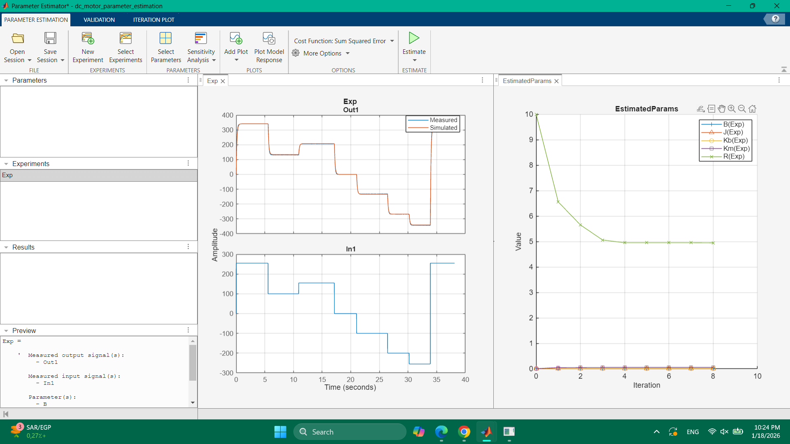
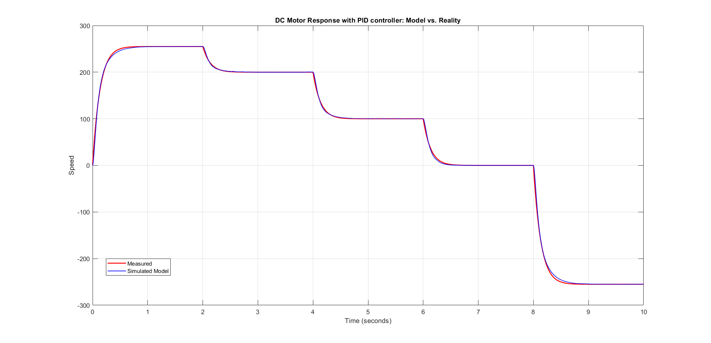

# Dc-motor
Parameter estimation and  controller desing for dc motor speed control
# DC Motor System Identification - GA25-370

This document records the experimental results and estimated parameters for the GA25-370 gearmotor setup using a high-frequency PWM control scheme.

## 1. Hardware Configuration
- **Motor:** GA25-370 (Nominal: 12V, 280RPM)
- **Microcontroller:** ESP32 (3.3V Logic)
- **Motor Driver:** Cytron MDD3A (3A Continuous, MOSFET-based)
- **Power Supply:** 13.85V (Measured via Avometer)
- **PWM Frequency:** 16 kHz (Ultrasonic range for smooth current)

## 2. Updated Motor Parameters
The following parameters were identified via Simulink Parameter Estimation. Note that the Gear Ratio and No-Load speed differ from online datasheet claims.

| Constant | Symbol | Value | Units |
| :--- | :--- | :--- | :--- |
| **Moment of Inertia** | $J$ | 2.657e-05 | $kg \cdot m^2$ |
| **Viscous Friction** | $B$ | 1.4411e-04 | $N \cdot m \cdot s/rad$ |
| **Armature Inductance**| $L$ | 0.18e-03 | $H$ |
| **Armature Resistance**| $R$ | 4.9476 | $\Omega$ |
| **Torque Constant** | $K_m$ | 0.0561 | $N \cdot m/A$ |
| **Back-EMF Constant** | $K_b$ | 0.0062 | $V / (rad/s)$ |
| **Gear Ratio** | $K_g$ | 20.45 (900/44) | - |
| **Encoder Resolution**| $PPR$ | 11 | pulses/channel/rev |

## 3. Critical Observations
- **Input Voltage:** The model must be simulated using **13.85V** as the rail voltage for accuracy.
- **Driver used:** The MDD3A driver is highly linear. Unlike the L298N, there is no need to subtract a 2V drop in the Simulink voltage conversion block.
- **Speed Correction:** The actual no-load speed was measured to be significantly different from the advertised 280 RPM.

## 4. Parameter Estimation Results 

## 5. PID Controller Performance (Closed Loop)
A PID controller was designed in Simulink using the identified parameters and implemented on the ESP32. The plot below shows the tracking performance for different speeds.

